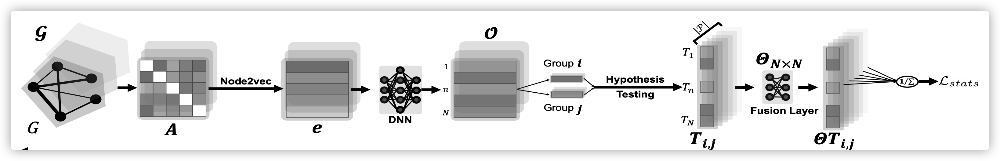

# Enriching Statistical Inferences on Brain Connectivity for Alzheimer's Disease Analysis via Latent Space Graph Embedding
The objective is to identify regions of interests (ROIs) in the brain that are affected by topological changes of brain connectivity due to specific neurodegenerative diseases by enriching statistical group analysis. We tackle this problem by learning a latent space where statistical inference can be made more effectively.

[[Paper]](https://ieeexplore.ieee.org/abstract/document/9098641)     

## Overview

## Author's Implementations

The experiments in our paper are done with the pytorch implementation.

## Citation
Please cite this paper if you want to use it in your work,

	@INPROCEEDINGS{9098641,
	  author={X. {Ma} and G. {Wu} and W. H. {Kim}},
	  booktitle={2020 IEEE 17th International Symposium on Biomedical Imaging (ISBI)}, 
	  title={Enriching Statistical Inferences on Brain Connectivity for Alzheimer's Disease Analysis via Latent Space Graph Embedding}, 
	  year={2020},
	  volume={},
	  number={},
	  pages={1685-1689},
	  doi={10.1109/ISBI45749.2020.9098641}}

## License
MIT License

